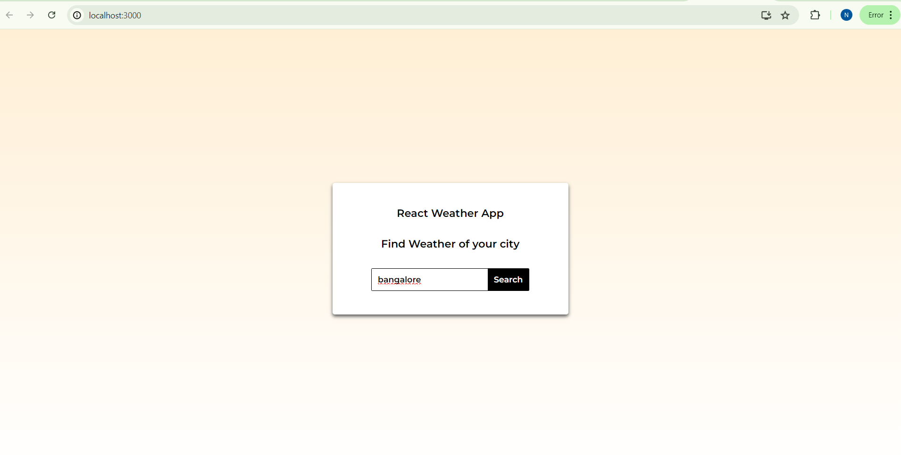
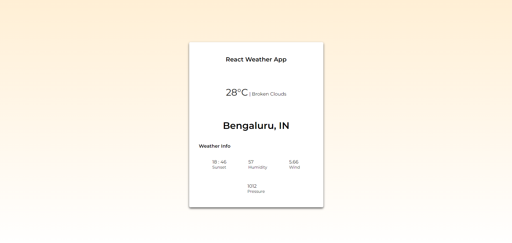

# React Weather App 

## Demo can be seen in the below :

- first the user is asked to enter the name of the city

- once the user enter the city name we fetch the weather details using the api as shown:

